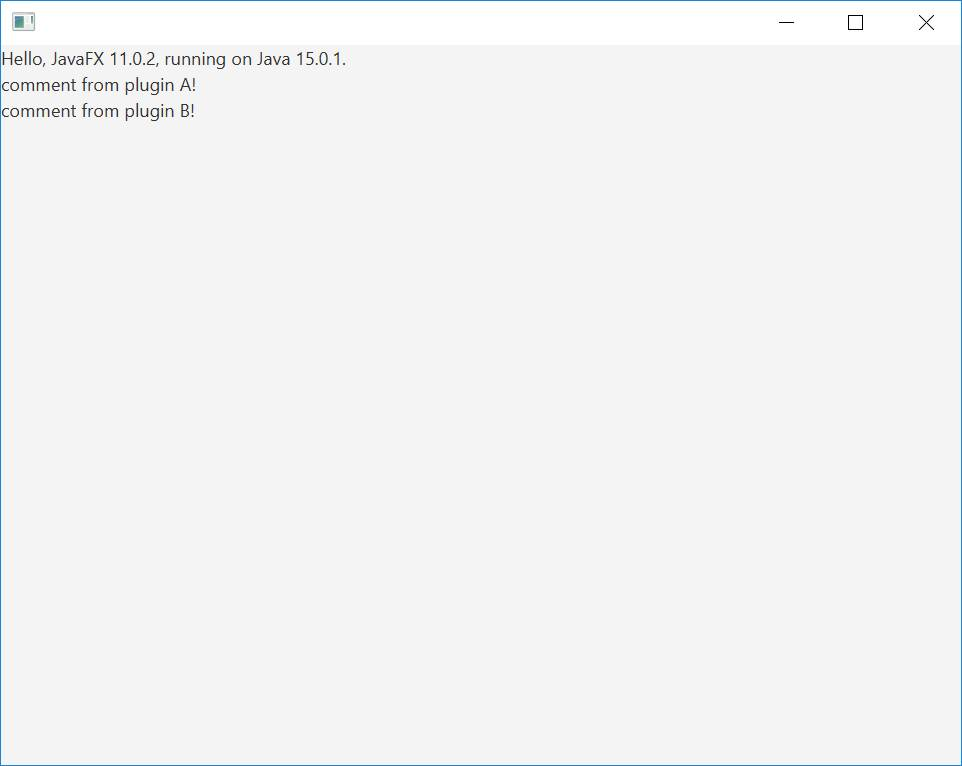

# working example of a javafx app discovering at run time 2 JPMS modules which have conflicting dependencies and loading them to separate layers

# build it
In your favorite IDE, open the parent project and run "clean and build". Or outside of your IDE, open the command line in the parent's project root folder and run `mvn clean install`

# run it
Launch the run.bat file, which contains:
`java --module-path mods/gui --module net.clementlevallois.javafxtest.gui`

# directories
- the `GUI` directory contains the JavaFX app, and the code loading the modules at runtime
- the `logic` directory contains the interface for modules. These interfaces are often called `api` or `serviceobserver` in other demo projects for jpms modules.
- `plugina` and `pluginb` are toy modules which have conflicting dependencies: one of them depends on guava 10, the other on guava 23. In a non modular app, java would complain. Here the two modules can run together.

# path
- the build places the built plugins and their dependencies in separate `mods/plugins/pluginxxx` folders
- `gui` and `logic` are also placed in separate subfolders within the `mods` folders
- the plugins are discovered in their subfolders by the main `gui` module thanks to a couple of lines at the beginning of the App.java main file.

# layers
The code for creating new layers for each plugin is adapted from [Nikolai Parlog's demo for layers](https://github.com/nipafx/demo-jpms-monitor/blob/feature-layers/monitor/src/main/java/monitor/Main.java), which comes with his book on [the Java Module System)](https://www.amazon.com/Java-Module-System-Nicolai-Parlog/dp/1617294284)

# dependencies
This should run without pre installed dependency on JavaFX, on any system (Mac, PC, Linux). But I am not 100% sure.

# feedback
Feedback is welcome. Open an issue or get in touch on Twitter ([@seinecle](https://twitter.com/seinecle)). I am not a professional Java dev, so I'll do my best to answer and direct you to complementary resources.
